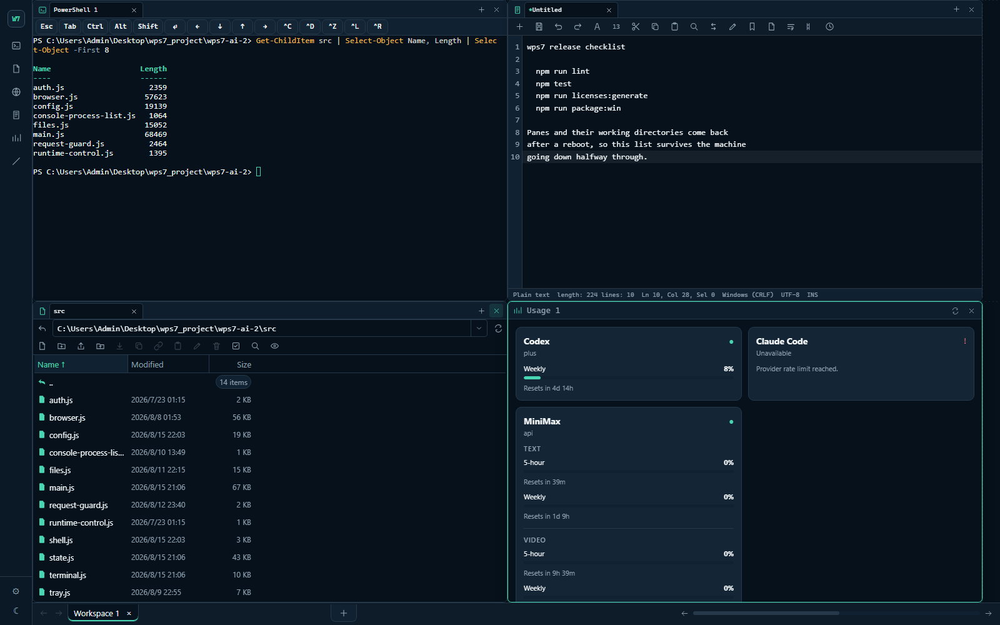
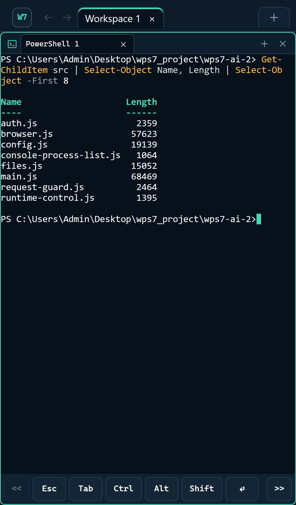

# wps7

English | [繁體中文](README.zh-TW.md)

Portable Windows web terminal workspace inspired by `tmux-continuum`. It serves
PowerShell sessions, a file manager, a notepad, a browser pane, and a whiteboard
to any browser on your machine, and rebuilds the layout after a reboot.

> [!WARNING]
> **wps7 gives a web browser access to PowerShell and to your file system.**
> Anyone who can reach the listening port and pass authentication can run
> arbitrary commands as the account running the server.
>
> The default configuration binds to `127.0.0.1` with no password, which is
> intended for single-user desktop use. **Before changing `server.host` to
> `0.0.0.0`, set a strong password** — the installer refuses to expose wps7 on a
> LAN without `auth.password_hash` for this reason.
>
> There is no TLS. On a LAN, the password, the session token, and all terminal
> output travel unencrypted. For anything beyond a trusted network, put wps7
> behind a reverse proxy that terminates TLS. See [SECURITY.md](SECURITY.md).



Panes tile on a grid, keep their working directory, and come back where you left
them. The same workspace from a phone browser shows one pane at a time, with a
key bar for the keys a touch keyboard does not have:



## Download

Take `wps7-<version>-windows-x64.zip` from the [releases page](../../releases).
The "Source code" archives GitHub generates beside it hold the source tree only,
without `wps7.exe`.

Extract the zip to a folder, then double click `wps7.exe`. Opening anything
inside the Windows zip viewer unpacks that one file to a temp directory and
leaves the rest in the archive.

wps7 is not code signed, so SmartScreen warns the first time a downloaded build
runs. Compare the SHA256 with `SHA256SUMS.txt`, then clear the download mark
before extracting — right click the zip, open Properties, tick Unblock, press OK.
Otherwise start `wps7.exe` once yourself and choose "More info" then "Run
anyway"; dismissing that prompt is what makes the launcher report `800704C7`.

## Run from source

```powershell
npm install
npm start
```

The app creates `config.toml`, `data/state.json`, and opens `http://127.0.0.1:5000`.

When running the packaged app, `config.toml`, `data/`, and logs live beside the packaged executable.

## Start at logon

To start wps7 whenever you log in:

```powershell
npm run startup:install
```

This creates `Startup\wps7.lnk` pointing at `wps7.exe`. wps7 then runs as you, in your own session, and shows its tray icon there.

Running in your session is what makes the rest work: a GUI program started from a terminal pane appears on your desktop, your mapped drives and environment are the ones panes inherit, and the usage pane finds the Codex and Claude Code logins in your profile. A Windows service cannot do any of that, because services run in session 0 with no interactive desktop and under their own account.

Nothing here needs Administrator. Installing asks for elevation only in two cases: to remove a service installed by an earlier version, and to open a firewall port when `server.host = "0.0.0.0"`.

The tray icon exposes Open Web UI, Save Now, Restart wps7, View Logs, Diagnostics, and Exit. Exit saves state and stops the server.

If the icon disappears while wps7 is still running, it is relaunched a couple of seconds later; a tray that fails to start five times in a row is given up on. `data/runtime.log` records each attempt.

If you set `server.host = "0.0.0.0"` for LAN access, configure a strong web password first. The installer refuses to expose wps7 on the LAN without `auth.password_hash` because the app provides browser access to PowerShell.

To remove the startup shortcut, and any leftovers from an older service install:

```powershell
npm run startup:uninstall
```

## Package

```powershell
npm run package:win
```

The packaged executable is written to `dist/wps7.exe`. pkg builds on a
console-subsystem Node binary, which would give the server a console window for
as long as it runs, so packaging rewrites the PE subsystem to `windows`. Double
clicking `dist/wps7.exe` starts it with no console.

## Restore model

Windows cannot resume arbitrary process memory after reboot. wps7 saves sessions, panes, cwd metadata, terminal scrollback, and the last command hint. On restart it recreates panes and automatically reruns only commands in `restore.allowlist`.

## PowerShell

wps7 prefers `pwsh.exe` and falls back to `powershell.exe`. If fallback is used, the web UI shows a PowerShell 7 install warning.

## Usage pane

The usage pane shows how much of your Codex, Claude Code, and MiniMax quota is
left. It reads those figures on the machine running wps7, from credentials those
tools have already written there:

- `%USERPROFILE%\.codex\auth.json` — the Codex OAuth access token.
- `%USERPROFILE%\.claude\.credentials.json` — the Claude Code OAuth access token.
- `usage.minimax_api_key` in `config.toml`, or `MINIMAX_CODING_API_KEY` /
  `MINIMAX_API_KEY` from the environment.

Each token is sent only to the provider it belongs to, and only to read quota.
None of them is stored in `data/state.json`; `data/runtime.log` records a token's
length, never the token.

When wps7's own profile has no such credentials, the lookup **searches the other
user profiles beside it** and takes the most recent login. On a shared machine
that means wps7 can report another account's quota, if the account running wps7
is allowed to read that profile. Pin one folder with `usage.codex_home` and
`usage.claude_home`, or turn a provider off with `usage.show_codex`,
`show_claude`, or `show_minimax`. All three ship enabled.

## Contributing

See [CONTRIBUTING.md](CONTRIBUTING.md) for the development setup and the
repository conventions. Report security issues privately through the process in
[SECURITY.md](SECURITY.md).

## License

MIT — see [LICENSE](LICENSE).

wps7 redistributes third-party code: the packaged executable embeds every
production dependency, and `public/vendor/` ships pre-built Excalidraw, React,
and xterm.js along with their fonts. Their notices are collected in
[THIRD-PARTY-LICENSES.md](THIRD-PARTY-LICENSES.md), regenerated with
`npm run licenses:generate`.

## Acknowledgements

- [Excalidraw](https://github.com/excalidraw/excalidraw) powers the whiteboard pane.
- [xterm.js](https://github.com/xtermjs/xterm.js) powers the terminal panes.
- [CodexBar](https://github.com/steipete/CodexBar) inspired the usage pane.
