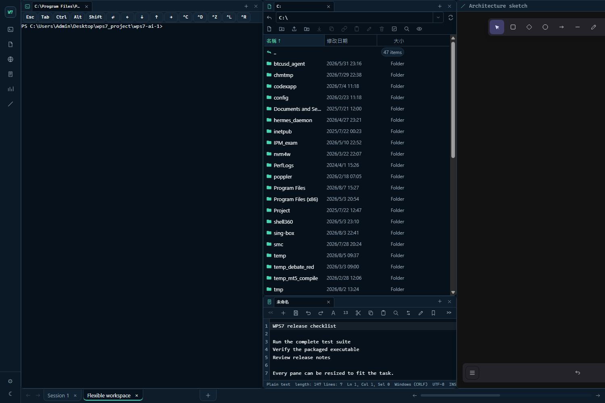
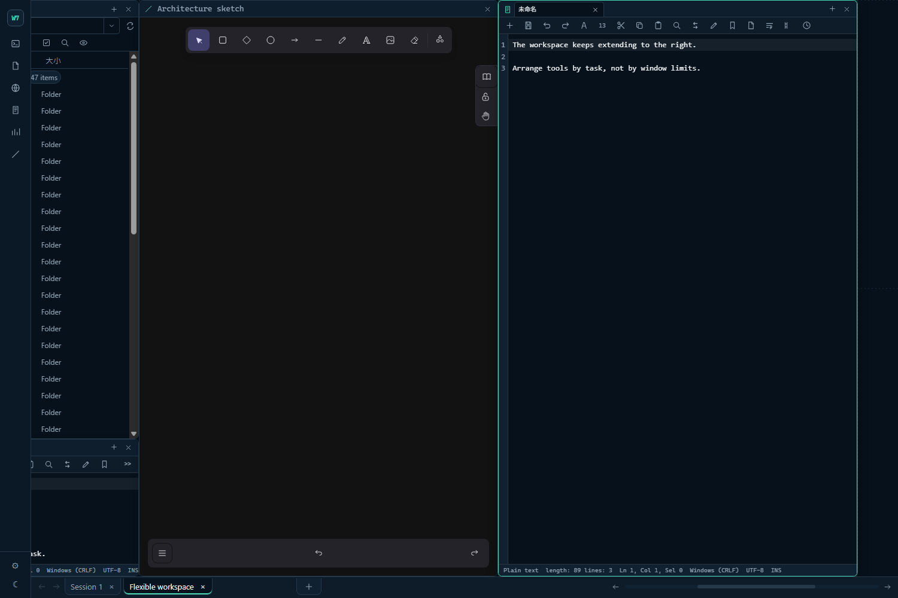

# wps7

繁體中文 | [English](README.md)

可攜式的 Windows 網頁終端工作區，設計概念來自 `tmux-continuum`。它把 PowerShell
工作階段、檔案管理員、記事本、瀏覽器窗格與白板提供給本機上的任何瀏覽器使用，並在
重新開機後重建原本的版面配置。

> [!WARNING]
> **wps7 等於把 PowerShell 和整個檔案系統開放給網頁瀏覽器存取。**
> 任何人只要能連到監聽的連接埠並通過驗證，就能以執行伺服器的帳戶身分執行任意指令。
>
> 預設設定綁定在 `127.0.0.1` 且不設密碼，這是為了單人桌面使用而設計的。
> **在把 `server.host` 改成 `0.0.0.0` 之前，請先設定一組強密碼** —— 安裝程式之所以
> 拒絕在沒有 `auth.password_hash` 的情況下把 wps7 暴露到區域網路，正是這個原因。
>
> 目前沒有 TLS。在區域網路上，密碼、工作階段權杖以及所有終端輸出都是以明文傳輸的。
> 若要用在信任網路以外的環境，請把 wps7 放在能終結 TLS 的反向代理後面。
> 詳見 [SECURITY.md](SECURITY.md)。


## 配合任務調整的工作區

每個窗格都可以在可自訂的格線上獨立移動和調整大小。你可以拉闊終端、把檔案管理員
疊在記事本上方，或讓白板佔滿整個高度；wps7 會保留版面和每個窗格的工作目錄。



桌面工作區的右邊沒有固定界線。新增窗格或把窗格移到更右的位置時，畫布會繼續橫向
延伸；底部捲動列讓你在不同窗格群組之間移動，不需要縮窄已經排好的窗格。



同一個工作區在手機瀏覽器上一次顯示一個窗格，並附上一排觸控鍵盤沒有的按鍵：


## 下載

請到[發行頁面](../../releases)下載 `wps7-<版本>-windows-x64.zip`。GitHub 一併產生的
「Source code」壓縮檔只包含原始碼，裡面沒有 `wps7.exe`。

請先把整個 zip 解壓縮到資料夾，再連按兩下 `wps7.exe`。直接在 Windows 的壓縮檔檢視器
裡開啟任何檔案，只會把那一個檔案解到暫存目錄，其餘檔案仍留在壓縮檔內。

wps7 沒有程式碼簽章，因此下載回來的版本第一次執行時 SmartScreen 會提出警告。請先用
`SHA256SUMS.txt` 比對 SHA256，然後在解壓縮前清除下載標記 —— 對 zip 按右鍵、開啟內容、
勾選「解除封鎖」、按確定。或者自己先執行一次 `wps7.exe`，選擇「更多資訊」再選「仍要
執行」；取消該提示正是啟動器回報 `800704C7` 的原因。

## 從原始碼執行

```powershell
npm install
npm start
```

程式會建立 `config.toml` 與 `data/state.json`，並開啟 `http://127.0.0.1:5000`。

執行打包後的版本時，`config.toml`、`data/` 與記錄檔會放在執行檔旁邊。

## 登入時自動啟動

若要讓 wps7 在你每次登入時自動啟動：

```powershell
npm run startup:install
```

這會建立指向 `wps7.exe` 的 `Startup\wps7.lnk`。wps7 便以你的身分、在你自己的工作階段
中執行，系統匣圖示也顯示在那裡。

在你的工作階段中執行，其他功能才成立：從終端窗格啟動的 GUI 程式會出現在你的桌面上，
窗格繼承到的是你的對應磁碟機與環境變數，用量窗格也找得到你 profile 裡的 Codex 與
Claude Code 登入。Windows 服務做不到這些，因為服務執行於工作階段 0，既沒有互動桌面，
也是以它自己的帳戶執行。

這裡沒有任何步驟需要系統管理員權限。安裝只有兩種情況會要求提權：移除舊版所安裝的服務，
以及在 `server.host = "0.0.0.0"` 時開啟防火牆連接埠。

系統匣圖示提供開啟網頁介面、立即儲存、重新啟動 wps7、檢視記錄、診斷與結束。「結束」會
儲存狀態並停止伺服器。

若 wps7 仍在執行但圖示消失了，它會在數秒後自動重新啟動；連續五次啟動失敗則不再重試。
每一次嘗試都會記錄在 `data/runtime.log`。

如果你為了區域網路存取而設定 `server.host = "0.0.0.0"`，請先設定一組強度足夠的網頁密碼。
安裝程式在沒有 `auth.password_hash` 的情況下會拒絕把 wps7 暴露到區域網路，因為這個程式
提供的是瀏覽器對 PowerShell 的存取權。

若要移除啟動捷徑，以及舊版服務安裝殘留的任何項目：

```powershell
npm run startup:uninstall
```

## 打包

```powershell
npm run package:win
```

打包後的執行檔會輸出到 `dist/wps7.exe`。pkg 是以主控台子系統（console subsystem）的
Node 執行檔為基底建置的，那會讓伺服器在整個執行期間都掛著一個主控台視窗，因此打包時會
把 PE 子系統改寫成 `windows`。連按兩下 `dist/wps7.exe` 就會在沒有主控台視窗的情況下啟動。

## 還原機制

Windows 在重新開機後無法還原任意行程的記憶體內容。wps7 會儲存工作區、窗格、工作目錄
中繼資料、終端捲動緩衝以及最後一個指令的提示。重新啟動時它會重建窗格，但只會自動重跑
列在 `restore.allowlist` 中的指令。

## PowerShell

wps7 優先使用 `pwsh.exe`，找不到時才退回 `powershell.exe`。若使用了退回選項，網頁介面
會顯示建議安裝 PowerShell 7 的提示。

## 用量窗格

用量窗格顯示你的 Codex、Claude Code 與 MiniMax 方案還剩多少額度。這些數字是在執行
wps7 的機器上讀取的，來源是那些工具本來就寫在該機器上的憑證：

- `%USERPROFILE%\.codex\auth.json` —— Codex 的 OAuth 存取權杖。
- `%USERPROFILE%\.claude\.credentials.json` —— Claude Code 的 OAuth 存取權杖。
- `config.toml` 中的 `usage.minimax_api_key`，或環境變數 `MINIMAX_CODING_API_KEY`
  / `MINIMAX_API_KEY`。

每一個權杖只會送往它所屬的供應商，而且只用於讀取額度。這些權杖都不會存進
`data/state.json`；`data/runtime.log` 只記錄權杖的長度，不會記錄權杖本身。

當 wps7 自己的 profile 裡沒有這些憑證時，查找程序**會搜尋旁邊其他使用者的 profile**，
並採用最近一次登入的那一組。在共用電腦上，這代表只要執行 wps7 的帳戶有權讀取該
profile，wps7 就可能顯示另一個帳戶的額度。你可以用 `usage.codex_home` 與
`usage.claude_home` 指定固定資料夾，或用 `usage.show_codex`、`show_claude`、
`show_minimax` 關閉個別供應商。這三項預設都是開啟的。

## 參與開發

開發環境設定與儲存庫慣例請參閱 [CONTRIBUTING.md](CONTRIBUTING.md)。安全性問題請依照
[SECURITY.md](SECURITY.md) 的流程私下回報，不要開公開的 issue。

## 授權

MIT —— 詳見 [LICENSE](LICENSE)。

wps7 會重新散布第三方程式碼：打包後的執行檔內嵌了所有正式相依套件，而 `public/vendor/`
則附帶預先建置的 Excalidraw、React、xterm.js 以及它們使用的字型。這些元件的授權聲明
彙整在 [THIRD-PARTY-LICENSES.md](THIRD-PARTY-LICENSES.md)，可用
`npm run licenses:generate` 重新產生。固定版本的上游授權檔可以先用
`npm run licenses:sync` 重新下載並核對雜湊。

## 致謝

- [Excalidraw](https://github.com/excalidraw/excalidraw) 提供白板窗格的功能。
- [xterm.js](https://github.com/xtermjs/xterm.js) 提供終端窗格的功能。
- [CodexBar](https://github.com/steipete/CodexBar) 啟發了用量窗格的設計。
