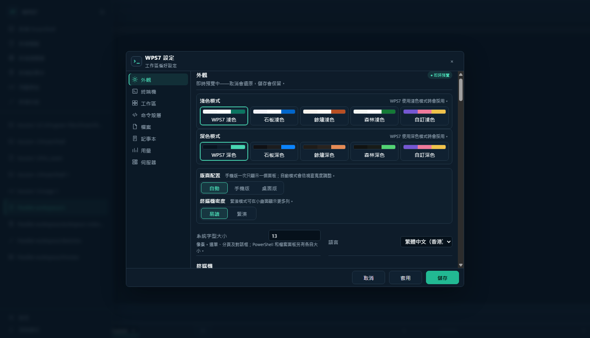
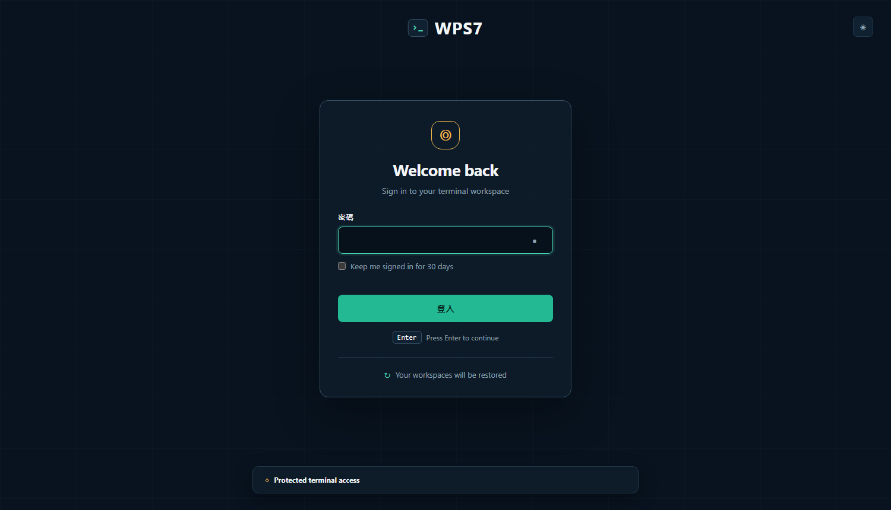

# WPS7 介面設計理念

## 1. 設計定位

WPS7 係一個以瀏覽器操作嘅 Windows 終端工作區，核心價值唔只係「開啟 PowerShell」，而係令使用者可以持續管理工作階段、終端分頁、Pane 佈局、檔案及重啟後還原狀態。

今次設計完全以產品功能重新建立介面語言，並無沿用現有 WPS7 畫面。整體定位係：

> 一個安靜、可靠、資訊密度適中，而且適合長時間使用嘅專業終端控制台。

設計關鍵字：

- 專業而克制
- 清晰嘅工作區層級
- 終端內容優先
- 系統狀態隨時可見
- 深色與淺色模式功能一致
- 適合桌面及流動裝置

## 2. 核心設計原則

### 終端內容優先

終端 Pane 佔用畫面最大部分，導覽、狀態及設定功能保持緊湊。非必要控制項可以摺疊，避免介面搶走終端內容嘅注意力。

### 工作階段係最高層級

介面資訊架構分成三層：

1. 工作區：代表一組持續保存嘅工作環境。
2. 分頁：用於區分不同任務，例如 PowerShell、Build 或 AI Agent。
3. Pane：同一分頁內可自由排列及調整大小嘅終端或檔案面板。

### 狀態可見但唔干擾

服務連線、工作階段還原、延遲、目前路徑及重啟要求等資訊，應該放喺穩定而容易搵到嘅位置，避免依賴短暫通知。

### 操作結果容易預測

所有可拖曳、縮放、切換及儲存嘅元素都要有明確狀態，包括選取框、分隔線、Resize Handle、Hover、Focus 及 Disabled 狀態。

## 3. 視覺語言

### 色彩方向

主要強調色採用 Mint／Teal，用於：

- 目前選取項目
- 鍵盤焦點
- 活動 Pane 邊框
- 已連線及成功狀態
- 主要操作按鈕

Amber 只用於警告、需要重新啟動或受保護存取，避免同一般操作爭奪注意力。

建議基礎色彩：

| 用途 | 深色模式 | 淺色模式 |
| --- | --- | --- |
| 主背景 | `#08131F` | `#F5F7F8` |
| 面板 | `#0E1C2A` | `#FFFFFF` |
| 次級面板 | `#142536` | `#EEF2F4` |
| 主要文字 | `#F2F6F7` | `#14202B` |
| 次要文字 | `#91A3B2` | `#667582` |
| 強調色 | `#48D6B2` | `#159D83` |
| 警告色 | `#F1B84B` | `#B97300` |
| 錯誤色 | `#FF7474` | `#C43D4B` |

實作時所有顏色應以 Design Token 或 CSS Variable 管理，唔應該直接散落喺各元件內。

### 字體

- 介面文字：`Segoe UI` 或系統 Sans Serif。
- 終端及技術資料：`Cascadia Mono`、`Consolas` 後備。
- 一般介面字級：13–14px。
- 終端預設字級：14px，並容許使用者調整。

### 形狀與層次

- 使用細緻 1px 分隔線建立結構。
- 圓角保持克制，建議 6–8px。
- 只喺浮動視窗、選單及設定面板使用陰影。
- 避免過多 Card、透明玻璃效果或裝飾性漸變。

## 4. 工作區設計

工作區由以下部分組成：

### 頂部 Command Center

集中顯示：

- WPS7 品牌及工作區名稱
- 工作區切換
- 服務在線狀態
- 視窗及全域操作

服務狀態使用綠色圓點配合文字，唔單靠顏色傳達資訊。

### 左側功能導覽

主要入口包括：

- Sessions
- Files
- Layouts
- History
- Settings
- Help／快捷鍵
- 登出

桌面模式可以顯示圖示及文字；窄屏幕可以摺疊成純圖示導覽。

### 工作分頁

分頁代表不同任務，而唔一定只代表一個 Shell。使用者可以建立 PowerShell、Build、AI Agent 或其他自訂分頁。

每個分頁提供：

- 活動狀態
- 未儲存或運行中提示
- 關閉操作
- 新增分頁
- 更多操作選單

### 模組化 Pane Canvas

主畫布支援多個可拖曳、縮放及重新排列嘅 Pane。每個 Pane 標題列顯示類型、名稱及 Pane 操作。

Resize Handle 及分隔線需要有清楚嘅 Hover／Active 回饋。活動 Pane 使用強調色邊框，但唔應該太光亮，以免長時間使用造成視覺疲勞。

### 工作區 Inspector

畫布底部或右側可以提供輕量 Inspector，顯示：

- 工作階段還原狀態
- 目前工作目錄
- 最後儲存時間
- Shell 類型
- 重新連線操作

### 狀態列

狀態列顯示持續性系統資訊，例如：

- WebSocket 連線狀態
- 服務健康
- 網絡延遲
- 安全狀態
- 後端 Shell

## 5. 深色與淺色模式

兩個模式應該共用相同資訊架構、尺寸、間距及元件狀態，切換主題唔會令版面跳動。

### 深色模式

適合長時間終端工作，以深藍黑而唔係純黑作主背景，減少極端對比。終端內容保持最高對比，周邊導覽稍為降低亮度。

### 淺色模式

以 Porcelain 白及冷灰建立層次，避免整個畫面只靠陰影分區。終端可以使用白色或輕微灰藍底，但必須確保 ANSI 顏色有足夠對比。

### System 模式

設定內提供 `System`、`Light`、`Dark` 三種選項。System 模式跟隨作業系統偏好，並保存使用者選擇。

## 6. 設定界面

設定介面採用固定分類導覽、中央表單及右側即時預覽，解決大量設定全部放喺單一長表單嘅問題。

建議分類：

- Appearance
- Terminal
- Workspace
- Persistence
- Shell
- Files
- Server
- Security

### 即時生效設定

例如主題、字體、字級、Cursor Blink、Sidebar Width 及 Pane Grid，可以即時套用，並喺右側 Preview 反映結果。

### 需要重新啟動嘅設定

Host、Port 或部分後端設定需要清楚標示「Requires restart」。儲存前後都應該提示，但唔應該阻止其他即時設定生效。

### 搜尋與重設

- 支援按名稱搜尋設定。
- 每個欄位可以顯示預設值。
- `Reset` 只重設目前分類，避免意外清除全部配置。
- `Save changes` 保持喺固定 Footer，長頁面捲動後仍然可用。

## 7. 登入界面

登入畫面需要明確表達 WPS7 係受保護嘅本機終端入口，而唔係一般雲端 SaaS 產品。

主要元素：

- WPS7 品牌
- Password 欄位
- 顯示／隱藏密碼
- Remember this device
- Sign in
- Enter 快捷鍵提示
- 本機服務地址及在線狀態
- Protected terminal access
- 登入後會還原工作階段嘅提示

登入失敗時，錯誤訊息應該放喺 Password 欄位附近，保留輸入內容並將焦點返回欄位。避免只用 Toast 表示登入失敗。

## 8. 響應式設計

### 桌面

- 顯示完整導覽文字、分頁及多 Pane Canvas。
- 支援滑鼠拖曳及 Resize Handle。
- 設定介面可以使用三欄結構。

### 平板

- 導覽縮成圖示 Rail。
- Inspector 改為抽屜。
- Pane 數量可以保留，但需要提供快速切換及全屏功能。

### 手機

- 預設一次顯示一個 Pane。
- Sessions、Files 及 Layouts 使用全高抽屜。
- 透過分頁或底部切換器轉換 Pane。
- 唔依賴細小 Resize Handle，改用預設 Layout 或方向按鈕調整。

## 9. 無障礙與鍵盤操作

- 文字及背景對比最少符合 WCAG AA。
- 所有狀態都配合文字或圖示，唔單靠顏色。
- Focus Ring 必須清楚，唔可以移除瀏覽器焦點而無替代樣式。
- 所有主要功能可以用鍵盤完成。
- Pane、分頁及導覽項目提供可讀嘅 Accessible Name。
- 動畫跟隨 `prefers-reduced-motion`。
- 終端及介面縮放唔應該造成內容被裁切。

建議快捷鍵：

| 操作 | 快捷鍵 |
| --- | --- |
| 新增分頁 | `Ctrl+Shift+T` |
| 關閉分頁 | `Ctrl+Shift+W` |
| 切換分頁 | `Ctrl+Tab` |
| 新增 Pane | `Ctrl+Shift+N` |
| 開啟檔案 | `Ctrl+Shift+E` |
| 開啟 Layout | `Ctrl+Shift+L` |
| 開啟設定 | `Ctrl+,` |
| 顯示快捷鍵 | `Ctrl+K` |

## 10. 元件狀態

每個互動元件至少需要定義：

- Default
- Hover
- Focus
- Active／Selected
- Disabled
- Loading
- Error

終端 Pane 另外需要：

- Connected
- Reconnecting
- Disconnected
- Restoring
- Restored
- Process exited

## 11. 實作建議

### Design Tokens

先建立統一 Token：

- Color
- Spacing
- Radius
- Typography
- Border
- Shadow
- Motion
- Z-index

深色及淺色模式只切換語義 Token，例如 `--surface-primary`、`--text-primary`、`--accent`，元件本身唔應該包含主題判斷。

### 漸進式改版

建議實作次序：

1. 建立色彩、字體及間距 Token。
2. 完成深色／淺色主題切換。
3. 重整工作區 Shell、導覽及狀態列。
4. 改善分頁及 Pane 狀態。
5. 重建分類式設定介面。
6. 更新登入畫面及錯誤狀態。
7. 完成手機單 Pane 模式及抽屜導覽。
8. 補充鍵盤操作、ARIA 及對比測試。

## 12. 成功標準

設計完成後應該達到以下結果：

- 使用者一眼可以分辨工作區、分頁及 Pane。
- 使用者隨時知道服務及終端係咪已連線。
- 重啟後還原狀態清楚可見。
- 深色與淺色模式功能及版面完全一致。
- 設定容易搜尋，並清楚區分即時生效與需要重啟。
- 登入畫面清楚表達本機服務、安全保護及工作階段還原。
- 桌面、平板及手機都可以完成核心操作。
